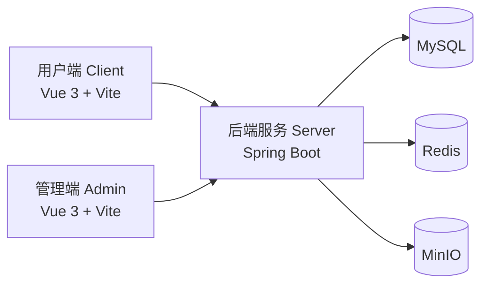

# 校园旧衣回收与流转平台项目分析

## 1. 项目识别

当前仓库项目为一个 **校园旧衣回收与流转平台**，采用 Monorepo 方式组织，包含用户端、管理端和后端三个子系统。

项目目标不是单纯做二手交易，而是围绕校园场景，将旧衣物的发布、审核、认领、积分激励、礼品兑换、消息通知、签到排行等能力整合为一体，形成“旧衣回收 + 校园流转 + 激励运营”的完整闭环。

从代码结构和业务实现来看，该系统更适合作为一个 **面向高校用户的旧衣资源回收与再利用管理系统**，兼顾环保公益属性和校园运营管理属性。

---

## 2. 系统总体架构

系统整体采用典型的前后端分离架构，由用户端、管理端、后端服务、数据库、缓存和对象存储共同组成。

### 2.1 架构组成

- `clothesRecycle-client/`：用户端前端，面向普通校园用户
- `clothesRecycle-admin/`：管理端前端，面向校区管理员和超级管理员
- `clothesRecycle-server/`：后端服务，负责业务逻辑、权限控制、数据处理与接口输出
- MySQL：存储核心业务数据
- Redis：存储登录态、验证码、签到数据、排行榜缓存、订单超时任务数据
- MinIO：存储物品图片等文件资源

### 2.2 架构关系

### 2.3 架构说明

1. 用户端主要提供衣物浏览、发布、认领、签到、积分、礼品兑换、消息中心等功能。
2. 管理端主要提供校区管理、管理员管理、回收点管理、用户管理、物品审核、礼品管理、数据看板等功能。
3. 后端采用单体 Spring Boot 架构，但内部仍按 Controller、Service、Mapper 分层，便于维护和扩展。
4. MySQL 用于持久化核心业务数据，Redis 主要承担高频状态数据和缓存职责，MinIO 负责文件资源存储。
5. 系统接口按前缀划分为公开接口、用户接口、管理端接口，具备清晰的权限边界。

---

## 3. 前后端技术栈

## 3.1 用户端技术栈

用户端位于 `clothesRecycle-client`，主要技术如下：

- Vue 3
- Vite
- Pinia
- Vue Router
- Axios
- Element Plus
- JavaScript

### 用户端特点

- 采用 Vue 3 组合式写法组织页面逻辑
- 采用移动端风格布局，底部 TabBar 统一导航
- 通过 Axios 与后端接口通信
- 通过 Pinia 管理用户登录态和部分全局状态

---

## 3.2 管理端技术栈

管理端位于 `clothesRecycle-admin`，主要技术如下：

- Vue 3
- Vite
- Pinia
- Vue Router
- Axios
- Element Plus
- ECharts
- vue-echarts
- JavaScript

### 管理端特点

- 面向后台运营和管理场景
- 提供数据看板和图表展示能力
- 支持不同管理员角色的权限控制
- 使用路由守卫实现登录校验与超级管理员页面控制

---

## 3.3 后端技术栈

后端位于 `clothesRecycle-server`，主要技术如下：

- Spring Boot 3.2.5
- MyBatis-Plus
- Sa-Token
- Spring Validation
- Spring Data Redis
- MinIO Java SDK
- Lombok
- JUnit 5 / Spring Test / MockMvc
- Maven
- Java 17

### 后端特点

- 采用 Spring Boot 单体服务架构
- 使用 MyBatis-Plus 简化数据库操作
- 使用 Sa-Token 实现登录认证与权限鉴权
- 使用 Redis 处理登录会话、验证码、排行和签到等高频数据
- 使用 MinIO 实现图片文件上传与访问
- 统一使用 `Result<T>` 封装返回结构
- 使用 `GlobalExceptionHandler` 统一处理异常

---

## 4. 系统角色设计

从代码实现来看，系统至少包含以下三类主要角色。

## 4.1 普通用户

普通用户是系统的核心使用者，主要使用用户端。

### 权限与功能

- 注册账号
- 登录系统
- 查看衣物列表和详情
- 发布旧衣物信息
- 上传衣物图片
- 查看我的发布
- 收藏感兴趣的衣物
- 发起认领订单
- 管理自己的订单
- 查看消息通知
- 编辑个人资料
- 修改密码或通过短信验证码重置密码
- 查看积分账户
- 参与签到
- 查看排行榜
- 在积分商城兑换礼品

---

## 4.2 校区管理员

校区管理员使用管理端，主要负责某个校区范围内的管理事务。

### 权限与功能

- 登录后台管理系统
- 审核本校区衣物发布信息
- 管理本校区用户
- 管理本校区回收点
- 查看后台数据看板中的相关数据

### 权限限制

- 不能管理全局校区信息
- 不能管理管理员账号
- 不能管理仅限超级管理员处理的礼品和部分系统级配置

---

## 4.3 超级管理员

超级管理员拥有系统全局管理权限，属于最高级别角色。

### 权限与功能

- 拥有校区管理员全部能力
- 管理校区信息
- 管理管理员账号
- 管理礼品信息
- 处理礼品兑换核销等全局事务
- 访问仅超级管理员可见的后台页面

---

## 5. 系统核心功能

## 5.1 用户端功能

### 1）用户认证模块
- 用户注册
- 用户登录
- 短信验证码发送
- 登录态保持
- 登录失效跳转

### 2）衣物流转模块
- 衣物列表展示
- 衣物详情查看
- 发布衣物
- 上传衣物图片
- 我的发布管理
- 收藏衣物

### 3）订单管理模块
- 发起认领订单
- 查看订单列表
- 取消订单
- 确认订单
- 完成订单
- 查看订单状态流转结果

### 4）个人中心模块
- 查看个人资料
- 编辑资料
- 修改密码
- 短信验证码重置密码
- 查看个人消息

### 5）积分激励模块
- 注册奖励积分
- 发布审核通过奖励积分
- 成交奖励积分
- 积分流水查询
- 积分商城兑换

### 6）活跃运营模块
- 每日签到
- 连续签到奖励
- 排行榜展示
- 消息通知

---

## 5.2 管理端功能

### 1）管理员认证模块
- 管理员登录
- 管理员登录态保持
- 角色权限判断

### 2）数据看板模块
- 统计核心业务数据
- 展示近 7 天数据变化
- 展示分类占比和状态分布

### 3）校区管理模块
- 校区新增
- 校区编辑
- 校区状态管理

### 4）管理员管理模块
- 管理员新增
- 管理员编辑
- 管理员状态管理
- 超级管理员权限控制

### 5）回收点管理模块
- 回收点新增
- 回收点编辑
- 回收点启用/停用

### 6）物品审核模块
- 查看待审核衣物
- 审核通过
- 审核拒绝
- 强制下架

### 7）用户管理模块
- 查看用户列表
- 新增用户
- 编辑用户
- 用户状态管理

### 8）礼品管理模块
- 礼品新增
- 礼品编辑
- 库存管理
- 兑换核销

---

## 5.3 后端支撑能力

后端不只是提供 CRUD 接口，还承担了完整业务规则控制，主要包括：

- 权限认证与会话管理
- 统一异常处理
- 统一响应封装
- 校区范围控制
- 文件上传处理
- 订单状态流转控制
- 积分冻结、结算、解冻
- 消息生成与消息状态管理
- Redis 缓存与排行榜处理
- 签到位图处理
- 超时订单自动取消

---

## 6. 关键业务流程

## 6.1 用户注册与登录流程

1. 用户输入手机号获取短信验证码。
2. 后端将验证码写入 Redis。
3. 用户填写注册信息完成注册。
4. 注册成功后系统自动登录，并给予注册积分奖励。
5. 用户后续访问受保护页面时，前端通过本地 token 与后端接口完成鉴权。

### 流程特点

- 使用 Redis 存储验证码
- 注册与积分奖励联动
- 登录态由 Sa-Token 与 Redis 支持

---

## 6.2 旧衣发布与审核流程

1. 用户上传衣物图片，后端保存到 MinIO。
2. 用户填写衣物信息并提交发布。
3. 衣物初始状态为待审核。
4. 管理员在后台查看待审核物品。
5. 审核通过后，衣物上架；审核拒绝则维持不可流转状态。
6. 审核结果通过站内消息通知用户。
7. 审核通过后，系统可为发布者发放积分奖励。

### 流程特点

- 前后端分离上传流程清晰
- 使用对象存储管理图片资源
- 审核与消息通知联动
- 审核通过与积分奖励联动

---

## 6.3 认领订单流程

1. 普通用户浏览衣物列表并查看详情。
2. 对处于可认领状态的衣物发起认领请求。
3. 后端创建订单，并将物品状态切换到交易中。
4. 若该衣物需要积分兑换，系统先冻结买家积分。
5. 卖家确认后进入后续交付流程。
6. 订单完成后，系统结算积分并更新物品状态。
7. 若订单取消或超时，则恢复相应资源状态并回滚冻结积分。

### 流程特点

- 对物品状态和订单状态做联动控制
- 对积分做冻结、恢复和结算处理
- 对超时未处理订单设置自动取消机制

---

## 6.4 签到与积分运营流程

1. 用户每日进入签到页面进行签到。
2. 系统通过 Redis 位图记录签到行为。
3. 根据连续签到天数发放不同档位积分。
4. 积分变化写入积分流水。
5. 排行榜可基于积分、捐赠量等维度展示活跃情况。

### 流程特点

- 使用 Redis 位图实现轻量级签到记录
- 使用积分体系增强用户参与度
- 使用排行榜提升用户活跃度和互动性

---

## 6.5 礼品兑换流程

1. 用户在积分商城查看礼品列表。
2. 选择礼品并提交兑换。
3. 系统扣减用户积分并减少礼品库存。
4. 系统生成兑换记录和兑换码。
5. 管理员在线下或后台进行核销处理。

### 流程特点

- 将用户行为与积分消费场景打通
- 礼品模块增强了系统的激励闭环

---

## 7. 数据层设计概括

从数据库脚本来看，系统包含较完整的业务表设计，核心实体包括但不限于：

- 用户表
- 管理员表
- 校区表
- 回收点表
- 物品表
- 物品图片表
- 订单表
- 收藏表
- 消息表
- 积分流水表
- 签到表或签到相关缓存结构
- 礼品表
- 礼品兑换表

### 数据层特点

1. 业务实体较完整，能够支撑从前台操作到后台治理的完整流程。
2. 订单、积分、消息、收藏、礼品等表共同构成业务闭环。
3. 文件资源不直接存数据库，而是通过 MinIO 存储 URL，提高扩展性。
4. 高频状态数据交由 Redis 处理，降低数据库压力。

---

## 8. 系统特色与论文可写亮点

## 8.1 单仓多端协同

系统采用 Monorepo 组织方式，在一个仓库中同时维护用户端、管理端和后端服务，有利于：

- 统一版本管理
- 提高联调效率
- 降低接口沟通成本
- 便于论文中展示整体性系统工程设计

---

## 8.2 角色分层明确

系统并非简单区分前台用户和后台管理员，而是细分出普通用户、校区管理员、超级管理员三种角色，并在前端路由和后端权限中落地。

这说明系统在设计时已经考虑了真实校园场景下的多层管理需求。

---

## 8.3 业务闭环完整

系统不是只做发布信息展示，而是完整覆盖了：

- 用户发布
- 后台审核
- 前台认领
- 订单流转
- 积分结算
- 消息通知
- 礼品兑换

这使得系统具备较强的完整性和可研究性，适合写进毕业论文中的“系统功能设计”和“业务流程设计”章节。

---

## 8.4 Redis 应用场景丰富

Redis 在系统中并非只用作简单缓存，而是承担了多种职责：

- 登录态持久化
- 短信验证码缓存
- 每日签到记录
- 排行榜缓存
- 订单超时控制

这一点可以作为论文中的技术亮点，体现系统对中间件的综合运用能力。

---

## 8.5 积分激励机制完善

系统设计了较为完整的积分激励体系，将注册、发布、审核通过、签到、订单完成、礼品兑换等多个行为纳入同一积分系统。

这使系统不只是一个回收平台，也具备运营激励属性，有助于提升用户活跃度和留存率。

---

## 8.6 对象存储接入真实业务

系统通过 MinIO 存储衣物图片，并将文件资源管理与业务流程结合，实现了更贴近真实部署场景的系统设计。

这比单纯将图片保存在本地目录更具有工程实践意义。

---

## 9. 当前项目的不足与可改进点

从现有代码实现来看，系统已经具备较完整功能，但仍存在一些可作为论文“系统不足与优化方向”章节的内容。

### 9.1 安全性仍可加强

- 密码处理方式仍较基础
- 短信验证码当前为模拟发送
- 开发配置偏向本地演示环境

### 9.2 自动化质量保障不足

- 前端未接入 lint 和自动化测试
- 后端虽然已有部分测试，但测试覆盖率仍有限
- 静态代码检查体系尚未完善

### 9.3 数据分析能力可继续增强

- 当前管理端已有数据看板，但报表维度仍可进一步扩展
- 后续可增加校区对比分析、用户活跃趋势分析、礼品兑换分析等功能

### 9.4 部署层面可进一步工程化

- 当前更偏向单体部署
- 后续可增加 Docker 化部署、配置分环境管理、CI/CD 流程等工程能力

---

## 10. 可直接用于毕业论文的项目定义

可以将本项目定义为：

> 本系统是一个面向高校场景的校园旧衣回收与流转平台，采用前后端分离架构设计，包含用户端、管理端和后端服务三个核心部分。系统围绕旧衣发布、后台审核、认领流转、积分激励、礼品兑换、签到排行和消息通知等核心业务展开，旨在提高校园旧衣资源的回收效率与再利用率，构建集环保、公益与运营管理于一体的数字化平台。

---

## 11. 论文撰写建议章节映射

如果后续要写毕业论文，可以直接把这个项目映射为以下章节结构：

### 第一章：绪论
- 项目背景
- 研究意义
- 国内外相关系统现状
- 本课题研究内容

### 第二章：需求分析
- 用户角色分析
- 功能需求分析
- 非功能需求分析
- 可行性分析

### 第三章：系统总体设计
- 系统架构设计
- 系统功能结构设计
- 数据库设计
- 权限设计

### 第四章：系统详细设计与实现
- 用户端模块实现
- 管理端模块实现
- 后端模块实现
- 文件上传、签到、排行榜、积分等重点模块实现

### 第五章：系统测试
- 功能测试
- 接口测试
- 权限测试
- 典型业务流程测试

### 第六章：总结与展望
- 项目总结
- 当前不足
- 后续优化方向

---

## 12. 一句话总结

该项目本质上是一个基于前后端分离架构实现的 **校园旧衣回收与流转管理系统**，其特色在于将环保回收、校园流转、管理员审核、积分激励、签到排行、礼品兑换等机制整合在同一平台中，具备较好的完整性、实用性和毕业设计研究价值。
